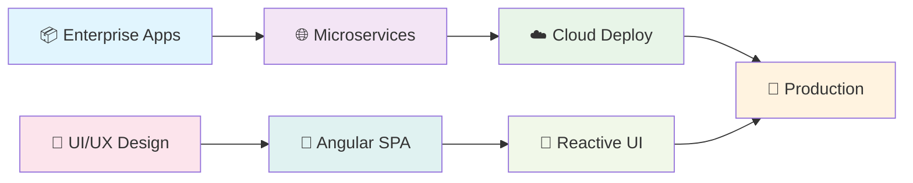

<div align="center">
  
</div>

<div align="center">
  
</div>

<div align="center">
  
</div>


##  About Me

<table>
<tr>
<td width="50%">

```typescript
class ImedZeiri {
  name: string = "Imed Zeiri";
  role: string = "Full Stack Developer";
  
  languages: string[] = [
    "Java", "TypeScript", "JavaScript", "SQL"
  ];
  
  frameworks: string[] = [
    "Spring Boot", "Angular", "Hibernate"
  ];
  
  databases: string[] = [
    "MySQL", "PostgreSQL", "MongoDB"
  ];
  
  architecture: string[] = [
    "Microservices", "REST APIs", "MVC"
  ];
  
  currentlyLearning() {
    return "Cloud Technologies & DevOps";
  }
  
  funFact() {
    return "I debug better with coffee! ☕";
  }
}
```

</td>
<td width="50%">

###  What I Do

🔸 **Full Stack Development** - Building end-to-end web applications  
🔸 **Backend Architecture** - Designing scalable Java/Spring Boot systems  
🔸 **Frontend Magic** - Creating responsive Angular interfaces  
🔸 **Database Design** - Optimizing queries and data structures  
🔸 **API Development** - RESTful services and microservices  
🔸 **DevOps Integration** - CI/CD pipelines and containerization  

###  Philosophy

*"Clean code is not written by following a set of rules. You don't become a software craftsman by learning a list of heuristics. Professionalism and craftsmanship come from values that drive disciplines."*

</td>
</tr>
</table>


##  Tech Stack

<div align="center">

| **Backend** | **Frontend** | **Database** | **DevOps & Tools** |
|:-----------:|:------------:|:------------:|:------------------:|
|  |  |  |  |
|  |  |  |  |
|  |  |  |  |
|  |  |  |  |
|  |  |  |  |

</div>

<div align="center">
  
</div>

<div align="center">
  
</div>

<div align="center">
  
</div>

##  What I'm Currently Working On

<div align="center">



</div>

- 🏗️ **Enterprise Applications** - Building scalable systems with **Spring Boot** & **Angular**
- 🌐 **API Architecture** - Designing RESTful services and microservices patterns
- 🔧 **DevOps Pipeline** - Implementing CI/CD with Docker and cloud deployment
- 📱 **Modern Frontend** - Creating responsive, accessible user experiences
- 🔒 **Security Focus** - JWT authentication, OAuth2, and secure coding practices

<div align="center">
  
</div>

##  What I'm Learning

<table>
<tr>
<td width="50%">

### ☁️ **Cloud Technologies**
- **AWS** - EC2, S3, RDS, Lambda
- **Azure** - App Services, Functions
- **Containerization** - Docker & Kubernetes

### 🔄 **Advanced Patterns**
- **Reactive Programming** - Spring WebFlux
- **Event-Driven Architecture**
- **CQRS & Event Sourcing**

</td>
<td width="50%">

### 🧪 **Best Practices**
- **Test-Driven Development**
- **Clean Architecture**
- **Domain-Driven Design**

### 🎨 **Modern Frontend**
- **Angular 17+** features
- **RxJS** advanced operators
- **Micro-frontends** architecture

</td>
</tr>
</table>

## 📈 GitHub Stats

<div align="center">
  
  
</div>

<div align="center">
  
</div>

## 🤝 Let's Connect!

<div align="center">
  <a href="https://linkedin.com/in/imed-zeiri" target="_blank">
    
  </a>
  <a href="mailto:your.email@example.com" target="_blank">
    
  </a>
  <a href="https://twitter.com/imed_zeiri" target="_blank">
    
  </a>
</div>

## 💡 Fun Facts

- ⚡ I love optimizing code performance and database queries
- 🎮 Gaming enthusiast and problem-solving addict
- ☕ Coffee-driven developer (debug better with caffeine!)
- 🌍 Always excited to collaborate on innovative projects

---

<div align="center">
  
</div>

<div align="center">
  
  
</div>

<div align="center">
  <picture>
    <source media="(prefers-color-scheme: dark)" srcset="https://raw.githubusercontent.com/ImedZeiri/ImedZeiri/output/github-contribution-grid-snake-dark.svg">
    <source media="(prefers-color-scheme: light)" srcset="https://raw.githubusercontent.com/ImedZeiri/ImedZeiri/output/github-contribution-grid-snake.svg">
    
  </picture>
</div>

<div align="center">
  
  <em>"Code is like humor. When you have to explain it, it's bad." – Cory House</em>
  
</div>

<div align="center">
  
</div>

<div align="center">
  
  <br>
  <strong>Thanks for visiting! Let's build something amazing together! 🚀</strong>
  <br>
  
</div>

