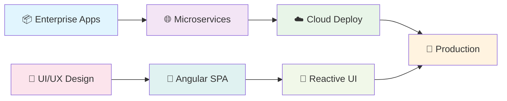

<!-- Premium Hero Section with Advanced Animations -->
<div align="center">
  
</div>

<!-- Premium Dynamic Professional Title -->
<div align="center">
  
</div>

<!-- Executive Professional Metrics Dashboard -->
<div align="center">
  <table>
    <tr>
      <td align="center">
        
      </td>
      <td align="center">
        
      </td>
      <td align="center">
        
      </td>
      <td align="center">
        
      </td>
    </tr>
  </table>
</div>

---

##  About Me

<table>
<tr>
<td width="50%">

```typescript
class ImedZeiri {
  name: string = "Imed Zeiri";
  role: string = "Senior Full Stack Developer";
  location: string = "Tunisia";
  
  languages: string[] = [
    "Java", "TypeScript", "JavaScript", "SQL"
  ];
  
  frameworks: string[] = [
    "Spring Boot", "Angular", "Hibernate"
  ];
  
  databases: string[] = [
    "PostgreSQL", "MySQL", "MongoDB", "Redis"
  ];
  
  architecture: string[] = [
    "Microservices", "REST APIs", "Event-Driven"
  ];
  
  currentlyLearning() {
    return "Cloud Technologies & DevOps";
  }
  
  funFact() {
    return "I debug better with coffee! ☕";
  }
}
```

</td>
<td width="50%">

###  What I Do

🔸 **Full Stack Development** - Building end-to-end web applications  
🔸 **Backend Architecture** - Designing scalable Java/Spring Boot systems  
🔸 **Frontend Excellence** - Creating responsive Angular interfaces  
🔸 **Database Design** - Optimizing queries and data structures  
🔸 **API Development** - RESTful services and microservices  
🔸 **DevOps Integration** - CI/CD pipelines and containerization  

###  Philosophy

*"Clean code is not written by following a set of rules. Professionalism and craftsmanship come from values that drive disciplines."*

</td>
</tr>
</table>

---

##  Professional Experience

<div align="center">
  
  
  
</div>

###  Current Role

#### 🚀 **Senior Full Stack Developer** | [Cric Payz](https://cricpayz.com) 
**📅 March 2025 - Present** | **🏢 Real-Time Sports Betting Platform**

<div align="left">
  
  
  
</div>

**🎯 Key Achievements:**
- 🏗️ **Scalable Architecture** - Developed high-performance RESTful and WebSocket APIs for real-time betting platform
- ⚡ **Performance Excellence** - Built low-latency systems handling live odds management and bet processing
- 📱 **Real-Time Features** - Implemented live betting via WebSockets with event-driven architecture
- 🎥 **Media Integration** - Integrated M3U8 live streams using HLS.js for seamless in-app sports viewing
- 🚀 **Optimization** - Enhanced performance under high traffic using Redis caching and efficient database design

**💻 Tech Stack:** `Java` `Spring Boot` `Angular` `WebSockets` `HLS.js` `Redis` `Docker` `PostgreSQL` `AWS` `JWT`

###  Previous Experiences

<details>
<summary><b>🏢 Smart Conseil - Full Stack Developer (Aug 2023 - Feb 2025)</b></summary>
<br>

#### 🛡️ **Full Stack Developer** | [Smart Conseil](https://smartconseil.com)
**📅 August 2023 - February 2025** | **🏫 Parental Control & School Safety Platform**

<div align="left">
  
  
  
</div>

**🎯 Key Achievements:**
- 🏗️ **Microservices Design** - Implemented scalable architecture reducing response times by **40%**
- 🔒 **Secure APIs** - Built RESTful services with Spring Boot ensuring reliable frontend-backend communication
- 📊 **Performance Boost** - Improved application availability by **30%** through Redis caching and query optimization
- 📈 **Analytics Integration** - Implemented privacy-friendly analytics (Matomo, Google Analytics) for behavioral insights
- 📚 **Documentation Excellence** - Generated comprehensive technical documentation using Compodoc

**💻 Tech Stack:** `Java` `Spring Boot` `Angular` `TypeScript` `Redis` `Microservices` `REST APIs` `Matomo`

</details>

<details>
<summary><b>🏢 Fontenay-IT - Full Stack Developer (Dec 2022 - Jun 2023)</b></summary>
<br>

#### 👥 **Full Stack Developer** | [Fontenay-IT](https://fontenay-it.com)
**📅 December 2022 - June 2023** | **🏢 HR Process Automation Platform**

<div align="left">
  
  
  
</div>

**🎯 Key Achievements:**
- ⚡ **Performance Optimization** - Improved response times by **60%** through query tuning and Redis caching
- 🎨 **UI Enhancement** - Boosted UI rendering performance by **25%** resolving critical bottlenecks
- 🐳 **Cost Reduction** - Containerized services with Docker, reducing infrastructure costs by **30%**
- 🔄 **CI/CD Implementation** - Set up automated pipelines with GitHub Actions for seamless deployments
- 👥 **Agile Collaboration** - Worked in cross-functional teams delivering features iteratively

**💻 Tech Stack:** `Java` `Spring Boot` `Angular` `Docker` `Redis` `JMeter` `GitHub Actions` `PostgreSQL`

</details>

###  Professional Impact Summary

<div align="center">
  <table>
    <tr>
      <td align="center" width="25%">
        
        <br><sub><b>Average performance gains across projects</b></sub>
      </td>
      <td align="center" width="25%">
        
        <br><sub><b>System availability improvements</b></sub>
      </td>
      <td align="center" width="25%">
        
        <br><sub><b>Infrastructure cost optimizations</b></sub>
      </td>
      <td align="center" width="25%">
        
        <br><sub><b>API response time improvements</b></sub>
      </td>
    </tr>
  </table>
</div>

---

##  Tech Stack Arsenal

###  Backend Technologies

<div align="center">
  <table>
    <tr>
      <td align="center" width="120">
        
        <br><strong>Java 17+</strong>
        <br><sub>Core Language</sub>
      </td>
      <td align="center" width="120">
        
        <br><strong>Spring Boot</strong>
        <br><sub>Framework</sub>
      </td>
      <td align="center" width="120">
        
        <br><strong>Microservices</strong>
        <br><sub>Architecture</sub>
      </td>
      <td align="center" width="120">
        
        <br><strong>Hibernate</strong>
        <br><sub>ORM</sub>
      </td>
      <td align="center" width="120">
        
        <br><strong>Maven</strong>
        <br><sub>Build Tool</sub>
      </td>
    </tr>
  </table>
</div>

###  Frontend Technologies

<div align="center">
  <table>
    <tr>
      <td align="center" width="120">
        
        <br><strong>Angular 17+</strong>
        <br><sub>Framework</sub>
      </td>
      <td align="center" width="120">
        
        <br><strong>TypeScript</strong>
        <br><sub>Language</sub>
      </td>
      <td align="center" width="120">
        
        <br><strong>RxJS</strong>
        <br><sub>Reactive</sub>
      </td>
      <td align="center" width="120">
        
        <br><strong>HTML5</strong>
        <br><sub>Markup</sub>
      </td>
      <td align="center" width="120">
        
        <br><strong>CSS3</strong>
        <br><sub>Styling</sub>
      </td>
    </tr>
  </table>
</div>

###  Database & Storage

<div align="center">
  <table>
    <tr>
      <td align="center" width="150">
        
        <br><strong>PostgreSQL</strong>
        <br><sub>Primary DB</sub>
      </td>
      <td align="center" width="150">
        
        <br><strong>MySQL</strong>
        <br><sub>Relational</sub>
      </td>
      <td align="center" width="150">
        
        <br><strong>MongoDB</strong>
        <br><sub>NoSQL</sub>
      </td>
      <td align="center" width="150">
        
        <br><strong>Redis</strong>
        <br><sub>Caching</sub>
      </td>
    </tr>
  </table>
</div>

###  DevOps & Cloud

<div align="center">
  <table>
    <tr>
      <td align="center" width="120">
        
        <br><strong>Docker</strong>
        <br><sub>Containers</sub>
      </td>
      <td align="center" width="120">
        
        <br><strong>AWS</strong>
        <br><sub>Cloud</sub>
      </td>
      <td align="center" width="120">
        
        <br><strong>CI/CD</strong>
        <br><sub>Automation</sub>
      </td>
      <td align="center" width="120">
        
        <br><strong>Git</strong>
        <br><sub>Version Control</sub>
      </td>
      <td align="center" width="120">
        
        <br><strong>Linux</strong>
        <br><sub>OS</sub>
      </td>
    </tr>
  </table>
</div>

<!-- Animated Skills Icons Showcase -->
<div align="center">
  
</div>

---

##  What I'm Currently Working On

<div align="center">



</div>

- 🏗️ **Enterprise Applications** - Building scalable systems with **Spring Boot** & **Angular**
- 🌐 **API Architecture** - Designing RESTful services and microservices patterns
- 🔧 **DevOps Pipeline** - Implementing CI/CD with Docker and cloud deployment
- 📱 **Modern Frontend** - Creating responsive, accessible user experiences
- 🔒 **Security Focus** - JWT authentication, OAuth2, and secure coding practices

---

##  Core Competencies & Skills

<div align="center">
  <table>
    <tr>
      <td align="center" width="20%">
        
        <br><sub><b>Java • Spring Boot • REST APIs</b></sub>
      </td>
      <td align="center" width="20%">
        
        <br><sub><b>Angular • TypeScript • RxJS</b></sub>
      </td>
      <td align="center" width="20%">
        
        <br><sub><b>Microservices • Event-Driven</b></sub>
      </td>
      <td align="center" width="20%">
        
        <br><sub><b>Optimization • Caching • Scaling</b></sub>
      </td>
      <td align="center" width="20%">
        
        <br><sub><b>Docker • CI/CD • AWS</b></sub>
      </td>
    </tr>
  </table>
</div>

###  Technical Proficiency Matrix

<table>
<tr>
<td width="50%">

#### 🎯 **Backend Excellence**
```java
@RestController
public class ExpertiseController {
    
    @Autowired
    private SkillService skillService;
    
    @GetMapping("/skills/backend")
    public ResponseEntity<List<Skill>> getBackendSkills() {
        return ResponseEntity.ok(
            Arrays.asList(
                new Skill("Java", "Expert", 5),
                new Skill("Spring Boot", "Expert", 5),
                new Skill("Microservices", "Advanced", 4),
                new Skill("WebSockets", "Advanced", 4),
                new Skill("JPA/Hibernate", "Expert", 5)
            )
        );
    }
}
```

#### 🗄️ **Database Mastery**
- **Relational:** PostgreSQL, MySQL, Oracle
- **NoSQL:** MongoDB, Redis
- **Optimization:** Query tuning, indexing, caching
- **Migrations:** Flyway, Liquibase

</td>
<td width="50%">

#### 🎨 **Frontend Mastery**
```typescript
@Component({
  selector: 'app-expertise',
  template: `
    <div *ngFor="let skill of frontendSkills$ | async">
      <skill-badge [skill]="skill"></skill-badge>
    </div>
  `
})
export class ExpertiseComponent {
  frontendSkills$ = this.skillService.getSkills([
    { name: 'Angular', level: 'Expert', years: 2 },
    { name: 'TypeScript', level: 'Expert', years: 2 },
    { name: 'RxJS', level: 'Advanced', years: 2 },
    { name: 'NgRx', level: 'Intermediate', years: 1 },
    { name: 'Angular Material', level: 'Advanced', years: 2 }
  ]);
}
```

#### 🚀 **Performance & Scalability**
- **Caching:** Redis, Caffeine, Browser caching
- **Load Testing:** JMeter, Artillery
- **Monitoring:** Application insights, logging
- **CDN:** Content delivery optimization

</td>
</tr>
</table>

###  Industry-Specific Experience

<div align="center">
  <table>
    <tr>
      <td align="center" width="33%">
        
        <br><sub><b>High-frequency trading, Live streaming, WebSocket APIs</b></sub>
      </td>
      <td align="center" width="33%">
        
        <br><sub><b>Parental controls, School safety, Privacy compliance</b></sub>
      </td>
      <td align="center" width="33%">
        
        <br><sub><b>Workflow automation, Employee management, Analytics</b></sub>
      </td>
    </tr>
  </table>
</div>

---

##  Continuous Learning & Development

<table>
<tr>
<td width="50%">

### ☁️ **Cloud & DevOps**
- **AWS Services** - EC2, S3, RDS, Lambda, ECS
- **Azure Platform** - App Services, Functions, AKS
- **Containerization** - Docker, Kubernetes, Helm
- **Infrastructure as Code** - Terraform, CloudFormation

### 🔄 **Advanced Architecture**
- **Reactive Programming** - Spring WebFlux, Project Reactor
- **Event-Driven Systems** - Apache Kafka, RabbitMQ
- **CQRS & Event Sourcing** - Axon Framework
- **Distributed Systems** - Service mesh, Circuit breakers

</td>
<td width="50%">

### 🧪 **Engineering Excellence**
- **Test-Driven Development** - JUnit, Mockito, Testcontainers
- **Clean Architecture** - Hexagonal, Onion patterns
- **Domain-Driven Design** - Bounded contexts, Aggregates
- **Security** - OAuth2, JWT, OWASP guidelines

### 🎨 **Modern Frontend**
- **Angular 17+** - Signals, Standalone components
- **State Management** - NgRx, Akita
- **Micro-frontends** - Module federation
- **PWA Development** - Service workers, Offline-first

</td>
</tr>
</table>

###  Recruiter Quick Facts

<div align="center">
  <table>
    <tr>
      <td align="center">
        
        <br><sub><b>Ready to start new projects</b></sub>
      </td>
      <td align="center">
        
        <br><sub><b>Open to hybrid/on-site</b></sub>
      </td>
      <td align="center">
        
        <br><sub><b>Bilingual communication</b></sub>
      </td>
      <td align="center">
        
        <br><sub><b>Based in Tunisia</b></sub>
      </td>
    </tr>
  </table>
</div>

---

## 📈 GitHub Stats

<div align="center">
  
  
</div>

<div align="center">
  
</div>

<!-- Premium GitHub Activity Graph -->
<div align="center">
  
</div>

---

## 🤝 Let's Connect!

<div align="center">
  <a href="https://linkedin.com/in/imed-zeiri" target="_blank">
    
  </a>
  <a href="mailto:your.email@example.com" target="_blank">
    
  </a>
  <a href="https://twitter.com/imed_zeiri" target="_blank">
    
  </a>
</div>

---

## 💡 Fun Facts

- ⚡ I love optimizing code performance and database queries
- 🎮 Gaming enthusiast and problem-solving addict
- ☕ Coffee-driven developer (debug better with caffeine!)
- 🌍 Always excited to collaborate on innovative projects

---

<!-- Profile Analytics Section -->
<div align="center">
  <h2>📊 Profile Analytics & Engagement</h2>
</div>

<div align="center">
  <table>
    <tr>
      <td align="center">
        
      </td>
      <td align="center">
        
      </td>
      <td align="center">
        
      </td>
    </tr>
  </table>
</div>

<!-- GitHub Contribution Snake Animation -->
<div align="center">
  <h3>🐍 GitHub Contribution Snake</h3>
</div>

<div align="center">
  <picture>
    <source media="(prefers-color-scheme: dark)" srcset="https://raw.githubusercontent.com/ImedZeiri/ImedZeiri/output/github-contribution-grid-snake-dark.svg">
    <source media="(prefers-color-scheme: light)" srcset="https://raw.githubusercontent.com/ImedZeiri/ImedZeiri/output/github-contribution-grid-snake.svg">
    
  </picture>
</div>

<!-- Professional Quote Section -->
<div align="center">
  
</div>

<!-- Call to Action Section -->
<div align="center">
  <h2>🚀 Ready to Collaborate?</h2>
</div>

<div align="center">
  <table>
    <tr>
      <td align="center" width="33%">
        
        <h4>🔥 Open Source</h4>
        <p>Contributing to amazing projects</p>
      </td>
      <td align="center" width="33%">
        
        <h4>👼 Freelance</h4>
        <p>Available for exciting projects</p>
      </td>
      <td align="center" width="33%">
        
        <h4>🌟 Full-Time</h4>
        <p>Looking for new opportunities</p>
      </td>
    </tr>
  </table>
</div>

<!-- Premium Footer with Wave Animation -->
<div align="center">
  
</div>

<!-- Final Thank You Message -->
<div align="center">
  
  <br><br>
  <h1>🚀 Thank You for Visiting! 🚀</h1>
  <h3>🌟 Let's Build Something Amazing Together! 🌟</h3>
  <p><em>Ready to turn ideas into exceptional digital experiences</em></p>
  <br>
  
</div>